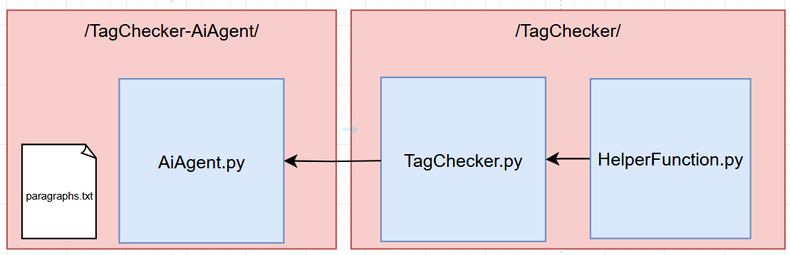

# TagChecker-AiAgent

to use TagChecker-AiAgent
1. Clone the repo
2. make a python virtual environment and run 
```python
pip install -r requirements.txt
```
3. run
```python
AIAgent.py
```
4. converse with a 1.5B model that will run locally on your machine. to run tag checker, replace the Paragraph.txt file with your tag checking question sample and ask the AI to "run tag checker".

5. When done, type "quit"

# BlockDiagram



# Notes
1. This repo is using huggingface to replace requiring api of paid models.
2. Interfacing hugging face model with langchain using huggingface pipelines.
3. Langchain tools do not work with hugging face pipelines as they don't have bind_tools methods, so I implemented a simple condition to replace react_agents.
